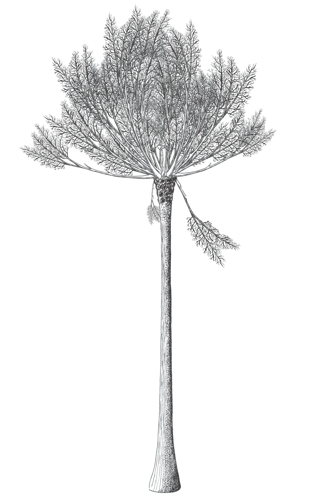
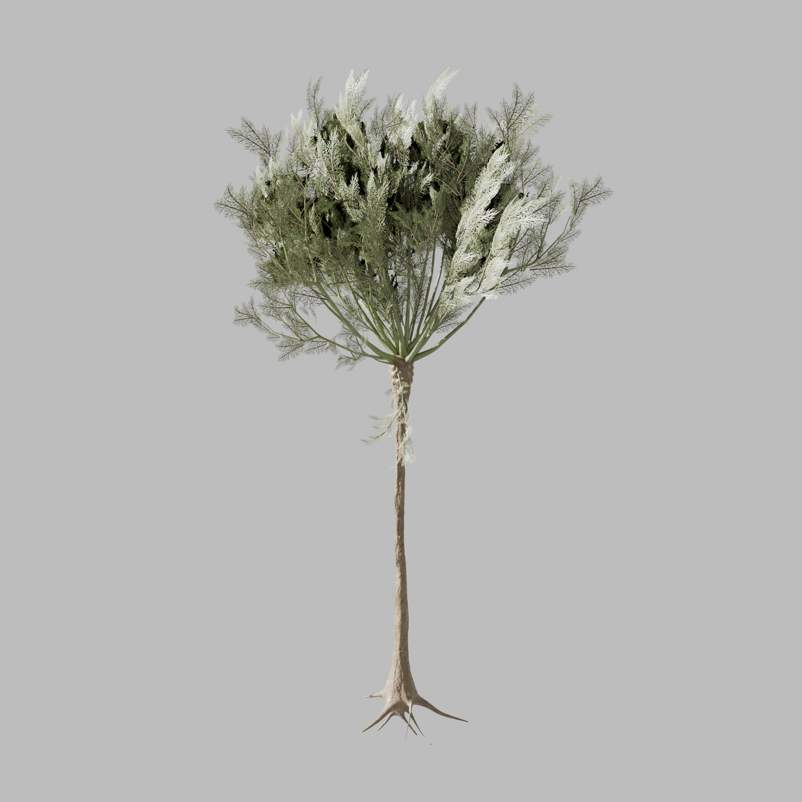

# Reflective Journal

## Entry 1 - 2026/09/09

This is the first entry of my Journal. Making a website with Markdown using Github was a new experience to me, even though I have a lot of GitHub Experience dating back to 2021. I usually just kind of ignore the README.md and focus entirely in the code, which now as I reflect on it might not be the best approach. A good README.md can make a difference in how your code is interpreted and even in how it stands out. There is nothing for me here that is particularly difficult to understand, as I get most of the concepts from previous experiences. I hope the future audience for my work will be impressed by it and inspired, because right now I'm the one who is inspired by all the talented designers out there. I want to become one of them, and to inspire, not just be inspired.

My aspirations: I hope to get good in 3D art and development, I have lots of ideas and I'm starting to work on some of them right now. A recent personal project of mine includes turning extinct flora species from the Devonian period into 3D models that are optimized for game use for Unreal Engine or Unity. This is an example:

### Artist's interpretation of extinct Pseudosporchnus, from around 360 million years ago:

### My 3D model based on the illustration:

