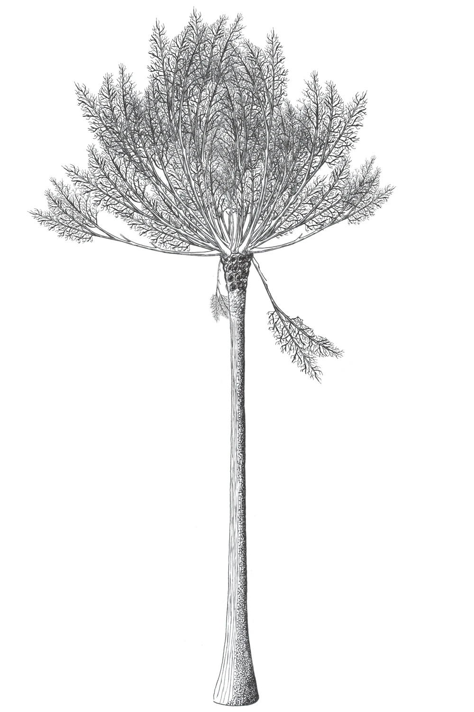
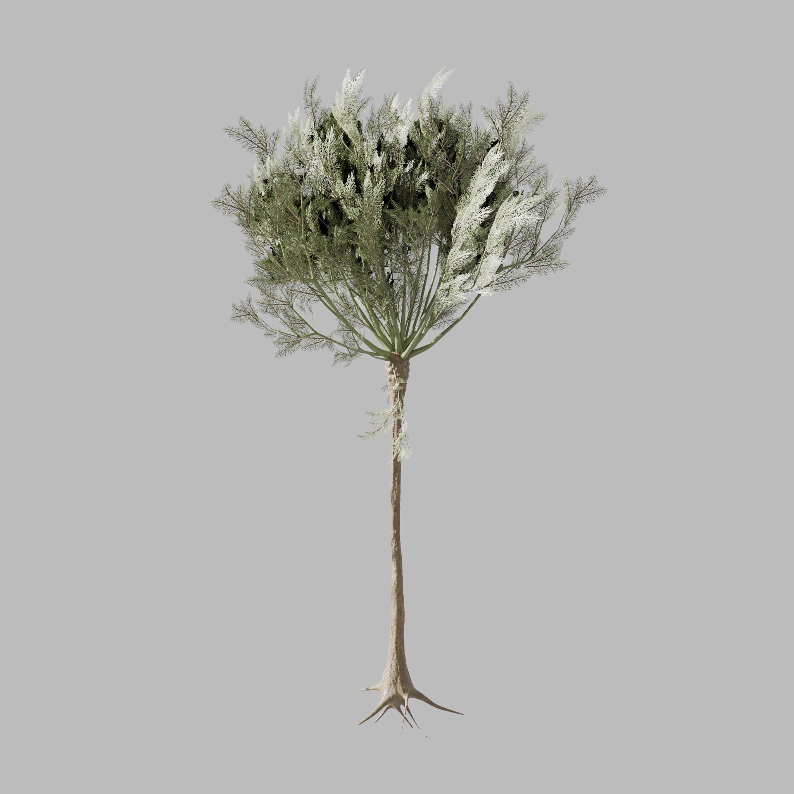

# Reflective Journal

## Entry 1 - 2026/09/09

This is the first entry of my Journal. Making a website with Markdown using Github was a new experience to me, even though I have a lot of GitHub Experience dating back to 2021. I usually just kind of ignore the README.md and focus entirely in the code, which now as I reflect on it might not be the best approach. A good README.md can make a difference in how your code is interpreted and even in how it stands out. There is nothing for me here that is particularly difficult to understand, as I get most of the concepts from previous experiences. I hope the future audience for my work will be impressed by it and inspired, because right now I'm the one who is inspired by all the talented designers out there. I want to become one of them, and to inspire, not just be inspired.

My aspirations: I hope to get good in 3D art and development, I have lots of ideas and I'm starting to work on some of them right now. A recent personal project of mine includes turning extinct flora species from the Devonian period into 3D models that are optimized for game use for Unreal Engine or Unity. This is an example:

### Artist's interpretation of extinct Pseudosporchnus, from around 360 million years ago:

### My 3D model based on the illustration:

## Entry 2 - 2026/09/24

This entry is a reflection of my activity for the Week 2 activities. I will be including a screenshot *below this entry* of my favorite image that I created using one of my prototypes. 

First, I started with the representational prototype which is of an orange cat. Orange cats are supposed to have only one or 2 braincells so It will definetly not take not a lot of brain power to make one (that was my logic).

Then, I moved on to the Abstract prototype. What you may see in there are not triangles. I hate p5 triangles so much that I, instead, made ones using thousands of squares and for loops :) very efficient

Finally, I made the really weird prototype. I wanted people to think: huh, that's a weird... thing... in the internet. And I gotta say, it is weird indeed. It makes no sense and may or may not cause seizures :P

## Entry 3 - 2026/09/30

The variables prototypes. One thing that I learned from this week was that I can't spend too much time and focus in one prototype (Prototype 1) and neglect the others. It is still hard for me to put equal effort into all of them. It sorta goes like this "Let's go! let's do it! I will do x, y, z, with this prototype and it will have this awesome feature." And by the 2nd and 3rd prototypes have exhausted all my creative energy. I am proud though, of what I managed to achieve with the first prototype. It took some studying with math stuff I hadn't heard of since high school to pull that off.

I think a good plan is to *plan*. Plan how the three prototypes are going to look like and work *prior to* starting to work on them, so hopefully I will have a more structured and balanced workflow for them.

## Entry 4 - 2026/10/06 - Conditional prototypes

This entry talks about my journey through the conditional prototypes. This time, I have created three separate ideas prior to starting the code. Initially, the first prototype was just going to be a bouncing ball around a square, and when it hit an edge it would change color. However, a mistake led me to make something where it "draws" the circles and never erases them, and with a beautiful color palette I have created a real-time active art making tool by an algorithm. I implemented the idea of "seeds" into the code, radomly generating one which dictates the x and y speeds of the ball. It would go from an x and y value between -20 and 20, for true directional randomness. I also used my prior knowledge of HTML forms to add input buttons so that users can try their own custom seeds into the program.

For the second conditional prototype, I originally had the idea of a "guess the number" type of game where the computer would generate a random number and the user has to guess it by getting "hot" or "cold". In the end, I changed that idea slightly and ended up making a game where you have to press the spacebar at exactly the number 100 to go to the next level. I used keystroke listeners for this one, and the framerate speed increases with each level.

For the third prototype, I had the idea to make a functioning traffic light with the click of a mouse. It sounds like a very simple and easy idea, but coding it told otherwise. I was expecting it to be easy, but it surprisingly took many if statements, objects, and draw functions to arrive in a perfect, mouse-controlled street light. Idea to add to it later: some traffic that responds to the light in the street light, and you have to control it.

Overall, I had a lot of fun making these prototypes, especially the first and last ones. I learned some things, and I'm slowly getting used to coding and thinking with my brain for once.
